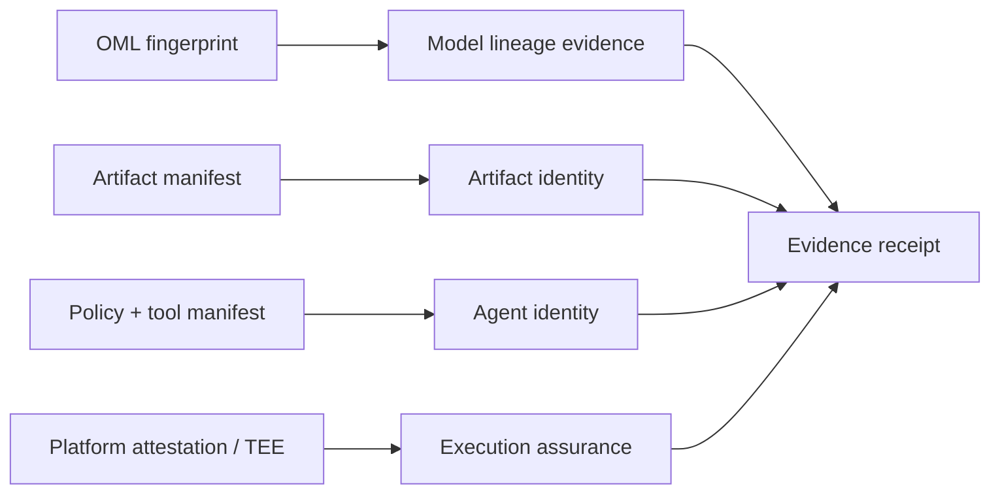

# Attestation and commerce roadmap

## Keep four identities separate

An honest trust framework distinguishes:

1. **Model lineage:** does the model respond to an OML fingerprint key as
   expected?
2. **Artifact identity:** do the weights, tokenizer, template, and runtime
   match named digests?
3. **Agent identity:** which policy and tool permissions define the agent that
   used the model?
4. **Execution integrity:** did protected code actually load those artifacts
   and produce this output?

No single signature answers all four.

## Assurance ladder

### L0 — Self-declared

The ordinary app hashes its model, tokenizer, runtime, prompt template,
policy, request, and response, then signs the receipt with an app-generated
key.

What it provides: tamper-evident provenance after the key is trusted.  
What it does not provide: proof that the app hashed the artifact it actually
executed.

### L1 — App/device-attested

The receipt key is hardware-backed or platform-attested. Android can attest
that a key is hardware-backed and can report security properties; Play
Integrity can provide evidence about a genuine app/device request. Apple App
Attest can attest a device-generated key and let a server validate later
assertions from a legitimate app instance.

What it adds: stronger resistance to key extraction, repackaged applications,
and simple replay.  
What it still does not prove: that user-space code truthfully measured the
model or that the attested app used the claimed weights for this inference.

This limitation must appear in the UI and receipt schema. A hardware-backed
key signing a false statement is still a valid signature over a false
statement.

### L2 — Measured load

A trusted component verifies the model/runtime digest during load and binds
that measurement to the receipt key and nonce. Reaching this level on commodity
phones may require an OEM integration, trusted application, protected virtual
machine, or platform feature not generally available to ordinary apps.

What it adds: evidence that a named artifact was admitted by trusted code.  
Residual gap: unmeasured code paths, I/O substitution, and inference outside
the protected boundary.

### L3 — Protected execution

The inference or a verifiable representation of it runs inside an attested
protected environment, or produces a cryptographic proof tied to exact model
and input commitments.

What it adds: the strongest execution claim.  
Cost: memory, performance, platform availability, implementation complexity,
and often dependence on device or cloud vendors.

Do not promise L3 in the first grant.

## Receipt fields

The first schema includes:

- schema and assurance level;
- agent and model identifiers;
- runtime, artifact format, and quantization;
- digests of runtime, weights, tokenizer, prompt template, and policy;
- privacy-preserving request and response commitments;
- server challenge/nonce and monotonic counter;
- platform attestation or measurement evidence when required;
- signature algorithm and signature.

Plain SHA-256 hashes of low-entropy prompts can leak private text through a
dictionary attack. Production request/response commitments should use a fresh
salt or keyed construction, with explicit rules for who can verify them. The
example receipt is structural only and intentionally not production
cryptography.

## Offline monetization boundary

OML fingerprinting can support ownership detection and lineage evidence. It
does not by itself enforce payment on a fully user-controlled offline device.
A local meter can be patched or bypassed.

A later prototype can test signed capability tokens, hardware-protected
counters, and periodic settlement, but the economic claim should be:

> detectable or economically accountable use under a stated device and
> connectivity model

—not “unbreakable offline DRM.”

## Shopping-agent application after the grant

The commercial product is a private personal shopping agent that keeps
preferences, budgets, purchase history, and risk rules on-device. Server calls
are limited to current offers and merchant APIs.

Each recommendation receipt can commit to:

- the local model and quantization;
- recommendation-policy version;
- merchants and offers considered;
- price, shipping, taxes, return cost, and risk inputs;
- affiliate commission for each candidate;
- selected item and explanation digest;
- whether user constraints were satisfied;
- agent tool permissions and any purchase authorization.

The commercial trust metric is commission neutrality: recommendation rank
should have near-zero unexplained correlation with affiliate rate after
controlling for user value. This is separate from OML fingerprint survival and
should not be forced into the first research result.

## Safe sequencing

1. Benchmark model lineage under on-device transformations.
2. Release L0 receipts and label them honestly.
3. Add Android L1 app/device attestation as a reference implementation.
4. Find an OEM/TEE/confidential-compute partner for L2.
5. Pilot the on-device shopping agent using L0/L1 receipts and affiliate
   disclosures.
6. Apply to the Sentient investment track with usage, conversion, savings, and
   trust metrics.
